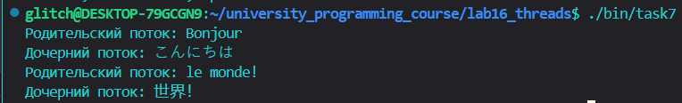
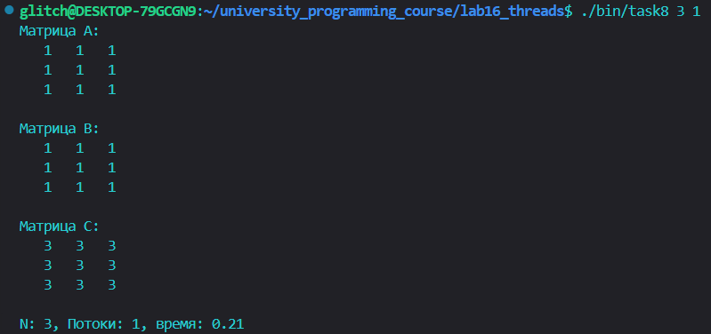
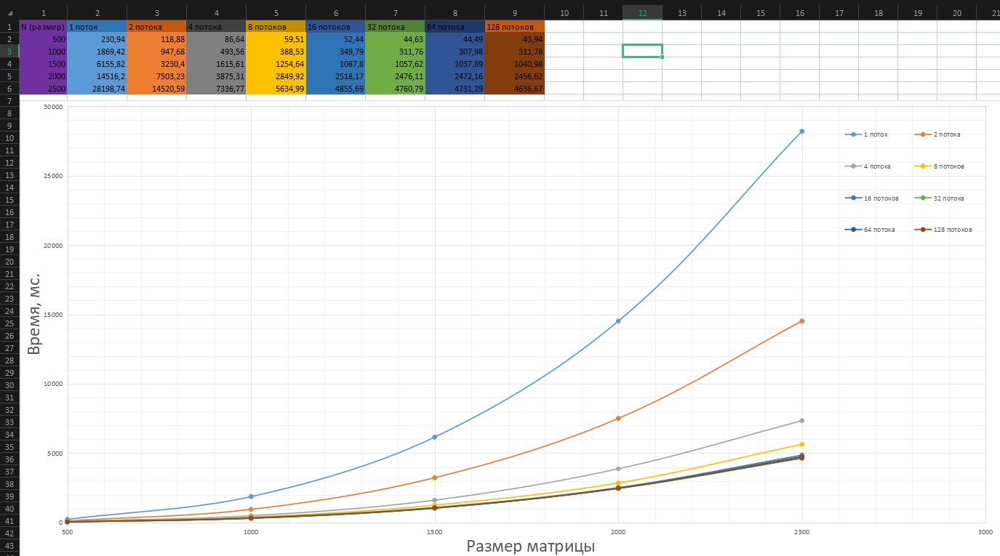

ОЦЕНКА 3. Знакомство с pthread

Задания 1-2:

С помощью pthread_create() были созданы родительский и дочерний потоки, выводящие на экран по 5строк текста. Во втором задании pthread_join() был перемещён перед началом цикла родительского потока. 

[task1-2.c](task1-2.c)

Задание 3:

Код задания 2 был модифицирован так, что основной поток создает 4 потока. Каждый из созданных потоков распечататывает
различные последовательности строк.

[task3.c](task3.c)

Задание 4:

Был добавлен сон с помощью sleep() в функцию потоков между выводами
строк. Также теперь спустя две секунды после создания дочерних потоков
основной поток прерывает работу всех дочерних потоков с
помощью pthread_cancel().

[task4.c](task4.c)

Задание 5:

Код задания 4 был модифицирован так, чтобы дочерний поток перед завершение
распечатывал сообщение об этом.

[task5.c](task5.c)

Задание 6:

Был реализован алгоритм сортировки Sleepsort.

[task6.c](task6.c)

ОЦЕНКА 4. Перемножение матриц

Задание 7:

Используя mutex, модифицировали программу упр. 5 так, чтобы вывод родительского и дочернего потока был синхронизован: сначала родительский поток выводить первую строку, затем дочерний, затем родительский вторую строку и т.д.

[task7.c](task7.c)

Задание 8:

Была написана функция произведения двух квадратных матриц A и B
размером NxN (на выходе получим матрицу C). Исходные матрица А и В заполняем единицами.

[task8-9.c](task8-9.c)

Задание 9:

Замерили время выполнения с момента создания потоков (до цикла с
pthread_create) и до завершения работы потоков (после цикла
pthread_join). Был построен график в exel, который показывает зависимость времени выполнения от размера матрицы и количества потоков.

