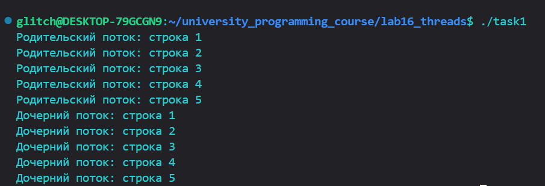
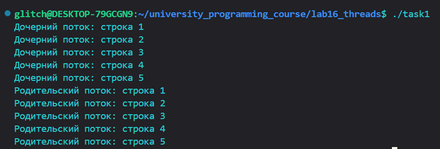
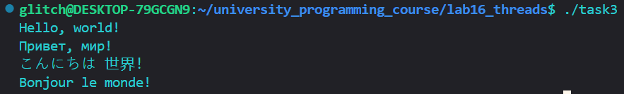
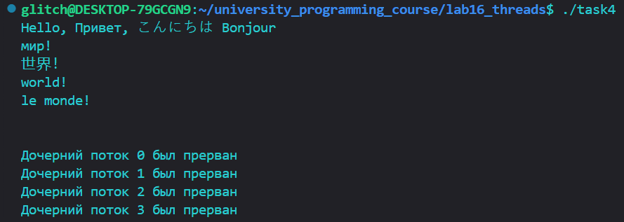
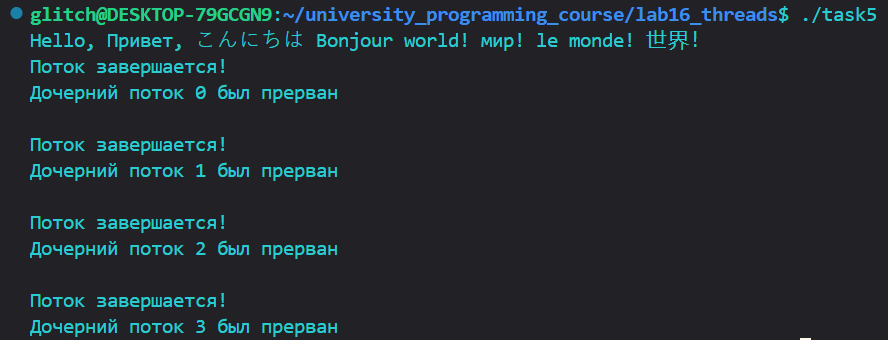
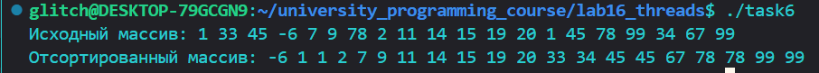

ОЦЕНКА 3. Знакомство с pthread

Задания 1-2:

С помощью pthread_create() были созданы родительский и дочерний потоки, выводящие на экран по 5строк текста. Во втором задании pthread_join() был перемещён перед началом цикла родительского потока. 

Задание 3:

Код задания 2 был модифицирован так, что основной поток создает 4 потока. Каждый из созданных потоков распечататывает
различные последовательности строк.

Задание 4:

Был добавлен сон с помощью sleep() в функцию потоков между выводами
строк. Также теперь спустя две секунды после создания дочерних потоков
основной поток прерывает работу всех дочерних потоков с
помощью pthread_cancel().

Задание 5:

Код задания 4 был модифицирован так, чтобы дочерний поток перед завершение
распечатывал сообщение об этом.

Задание 6:

Был реализован алгоритм сортировки Sleepsort.

