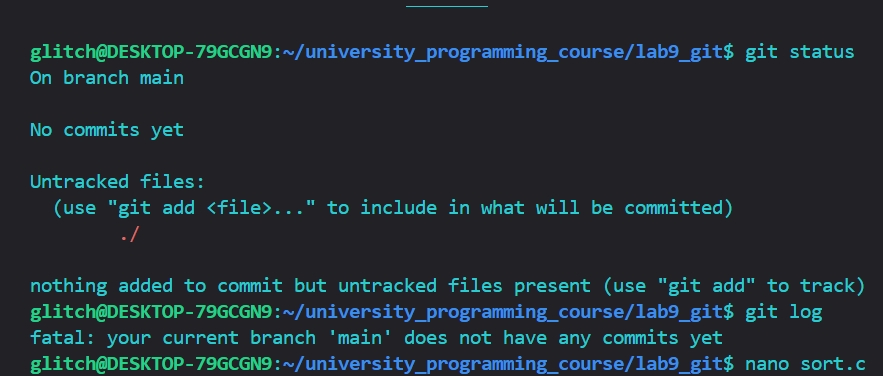
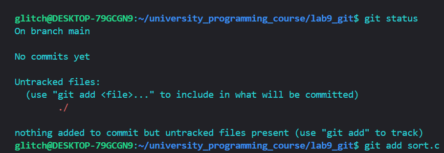
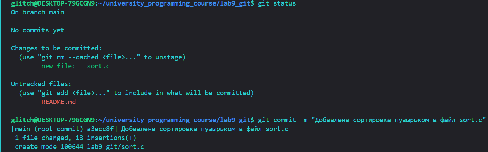
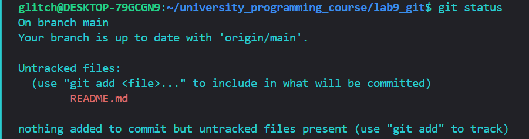
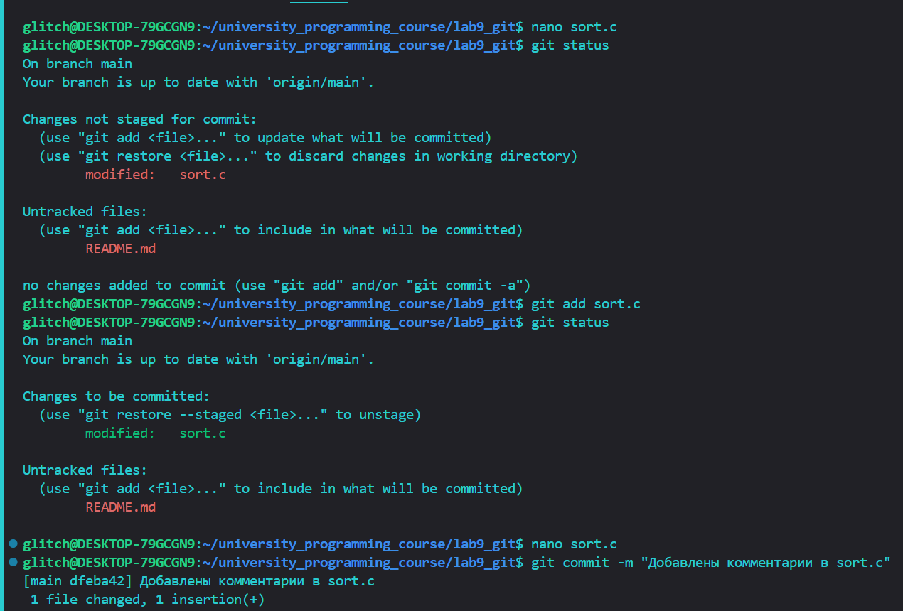
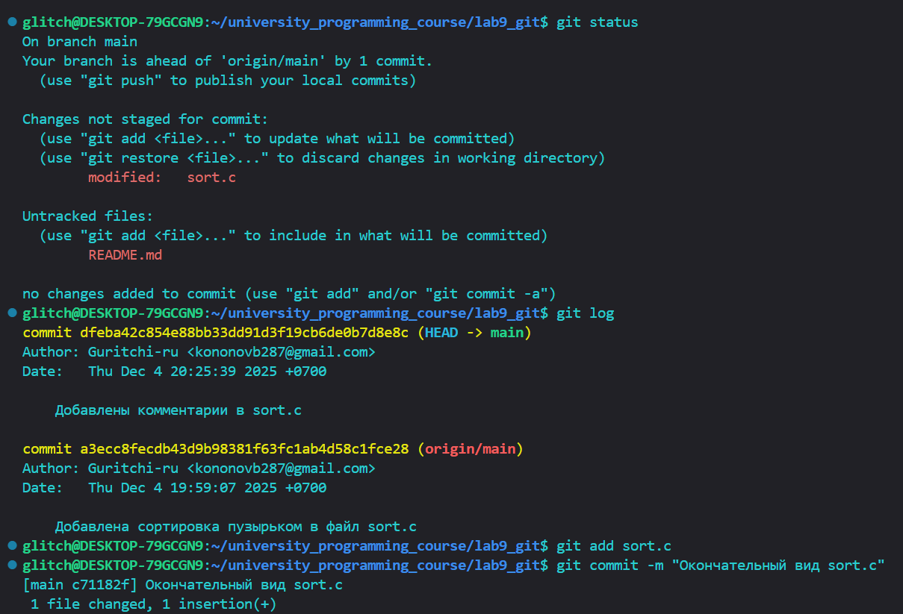
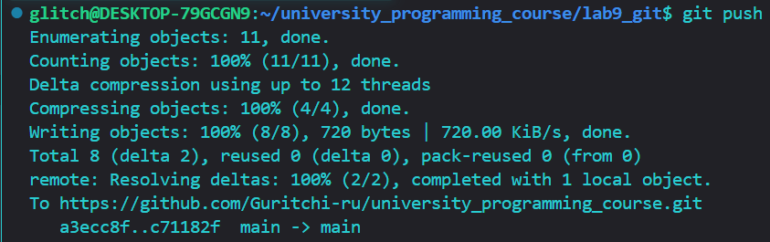
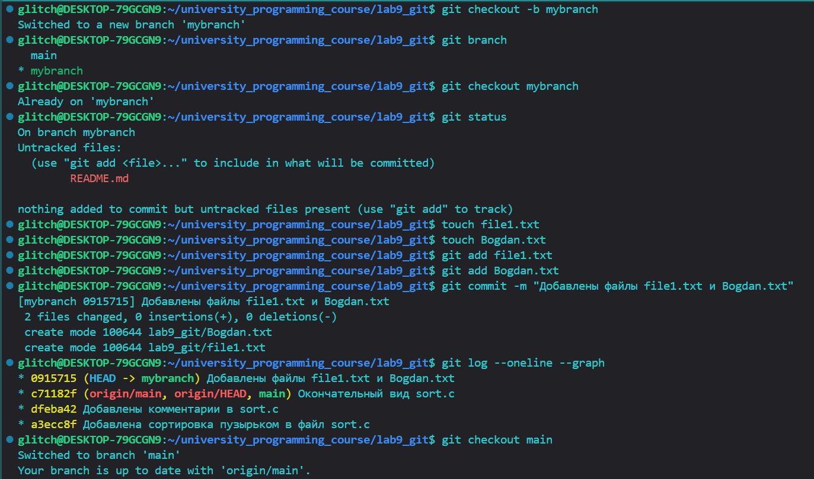
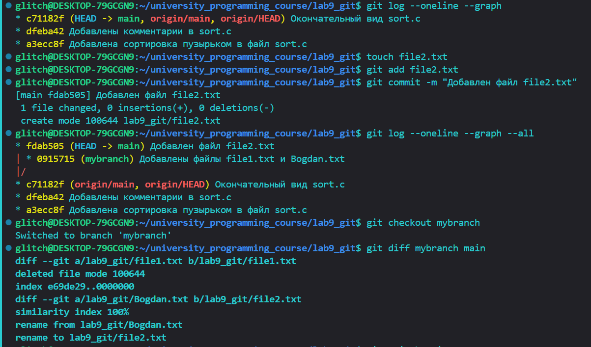

ОЦЕНКА 3

Шаги 1-3

// git log показывает историю коммитов в текущей ветке, так как мы ещё ничего не сделали, выведется сообщение о том, что данная ветка не имеет коммитов.

Шаги 4-7

// На 4-ом шаге вывод git status не изенился, так не было ещё внесено никаких изменений.

// На 6-ом шаге при вызове git status отображаются неотслеживаемый файл README.MD и что изменения в sort.c готовы к коммиту. 

Шаги 8-14

Шаги 15-17

// после коммита git status указывает что наша ветка опережает 'origin/main' на 1 коммит, следует сделать push.

// при помощи git log также можем увидеть что коммит на котором мы находимся (HEAD) впереди от origin/main на 1 коммит и все остальные коммиты с их описанием.

Работа с ветками

Шаги 1-9

// при помощи git checkout -b создаём новую ветку и переключается на неё. 

//git branch и git status показывют что мы находимся на новой ветке mybranch

Шаги 10-15

// После переключения на основную ветку при использовании git log --oneline --graph мы уже не увидим ветку mybranch

// file2.txt не пропал, а остался в ветке master

// git dif показывает разницу между ветками, в ветке main есть файл file2.txt, в ветке mybranch - file1.txt  

Шаги 16 и 17
