ОЦЕНКА 3

Шаги 1-3

// git log показывает историю коммитов в текущей ветке, так как мы ещё ничего не сделали, выведется сообщение о том, что данная ветка не имеет коммитов.

Шаги 4-7

// На 4-ом шаге вывод git status не изенился, так не было ещё внесено никаких изменений.

// На 6-ом шаге при вызове git status отображаются неотслеживаемый файл README.MD и что изменения в sort.c готовы к коммиту. 

Шаги 8-14

Шаги 15-17

// после коммита git status указывает что наша ветка опережает 'origin/main' на 1 коммит, следует сделать push.

// при помощи git log также можем увидеть что коммит на котором мы находимся (HEAD) впереди от origin/main на 1 коммит и все остальные коммиты с их описанием.

Работа с ветками

Шаги 1-9

// при помощи git checkout -b создаём новую ветку и переключается на неё. 

//git branch и git status показывют что мы находимся на новой ветке mybranch

Шаги 10-15

// После переключения на основную ветку при использовании git log --oneline --graph мы уже не увидим ветку mybranch

// file2.txt не пропал, а остался в ветке master

// git dif показывает разницу между ветками, в ветке main есть файл file2.txt, в ветке mybranch - file1.txt  

Шаги 16 и 17

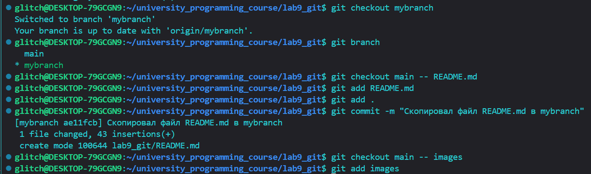
// копируем файл README.md из main в mybranch

ОЦЕНКА 4

Шаги 1-4
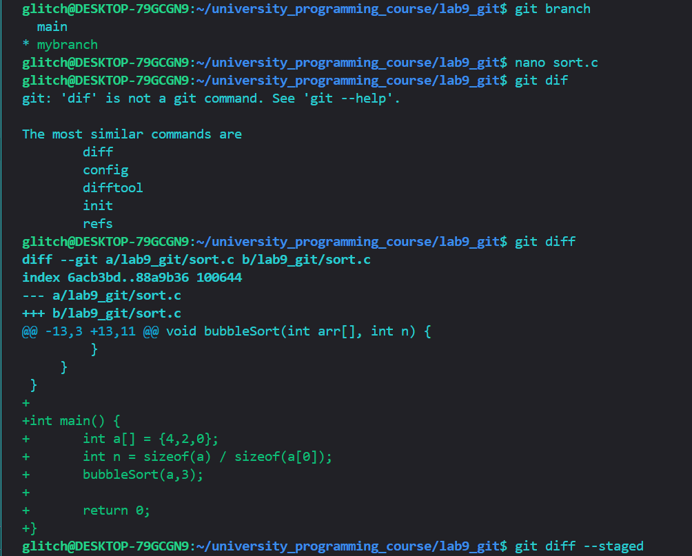
// git diff указывает на строки, которые мы добавили в sort.c

// git diff --staged пуст, потому что ничего не было добавлено в стейдж

Шаги 5-8
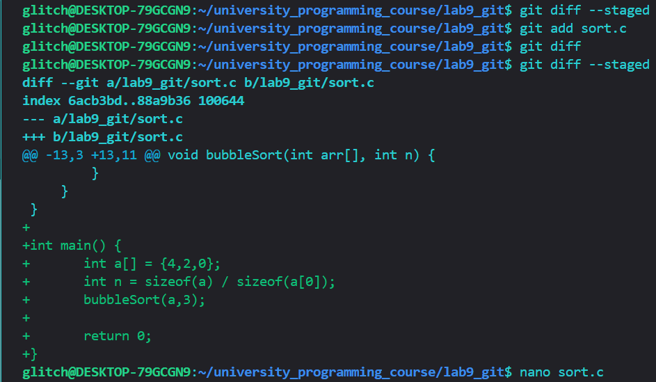
// Теперь git diff пустой, а git diff --staged указывает на проиндексированные изменения которые ранее отображал git diff

Шаги 9-11
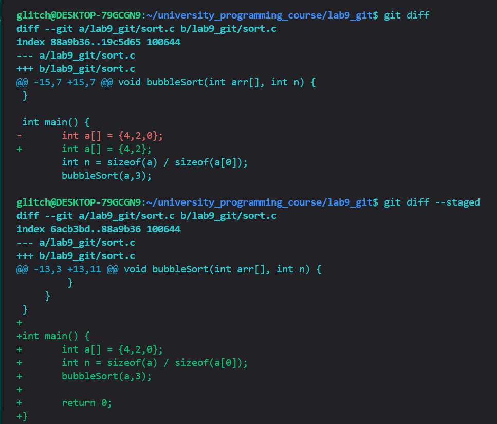
// git diff указывает на отличия между проиндексированным и непроиндексированными файлами

// в выводе git diff --staged ничего не изменилось

Шаги 12-15
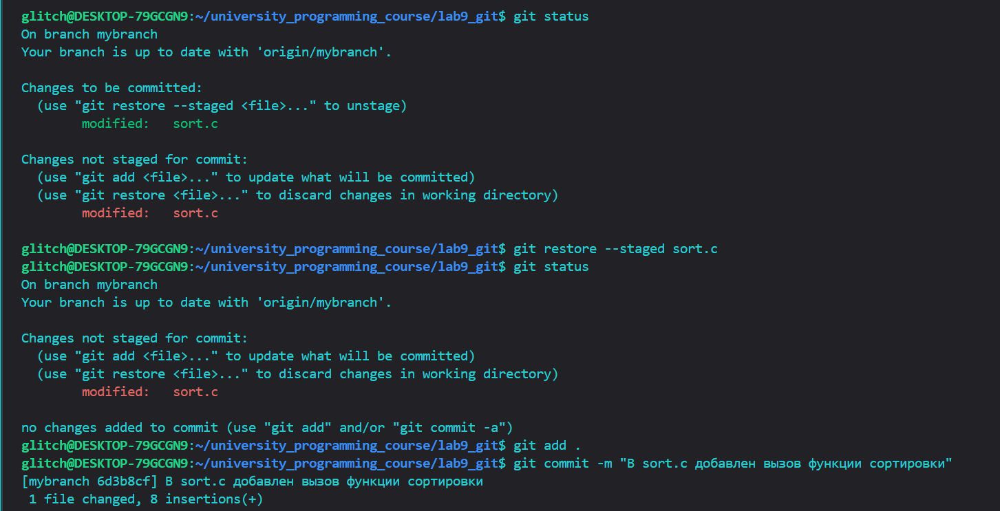
// git status указывает, что есть проиндексированные изменения в sort.c и непроиндексированные (поэтому sort.c присутствует дважды)
Шаг 16
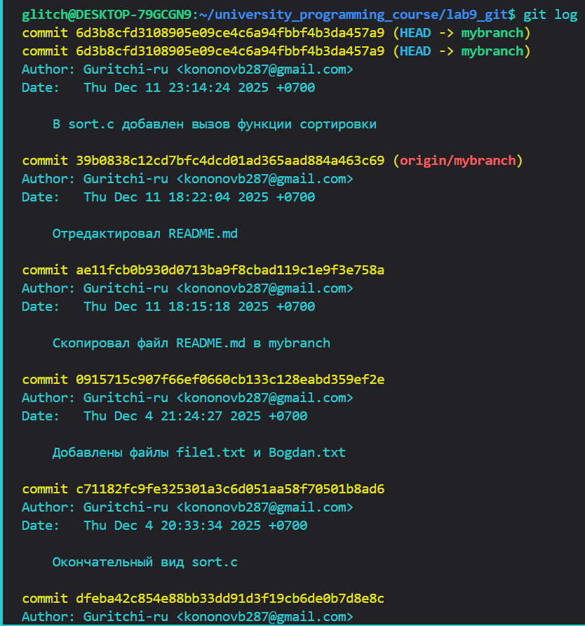
Шаги 17-23
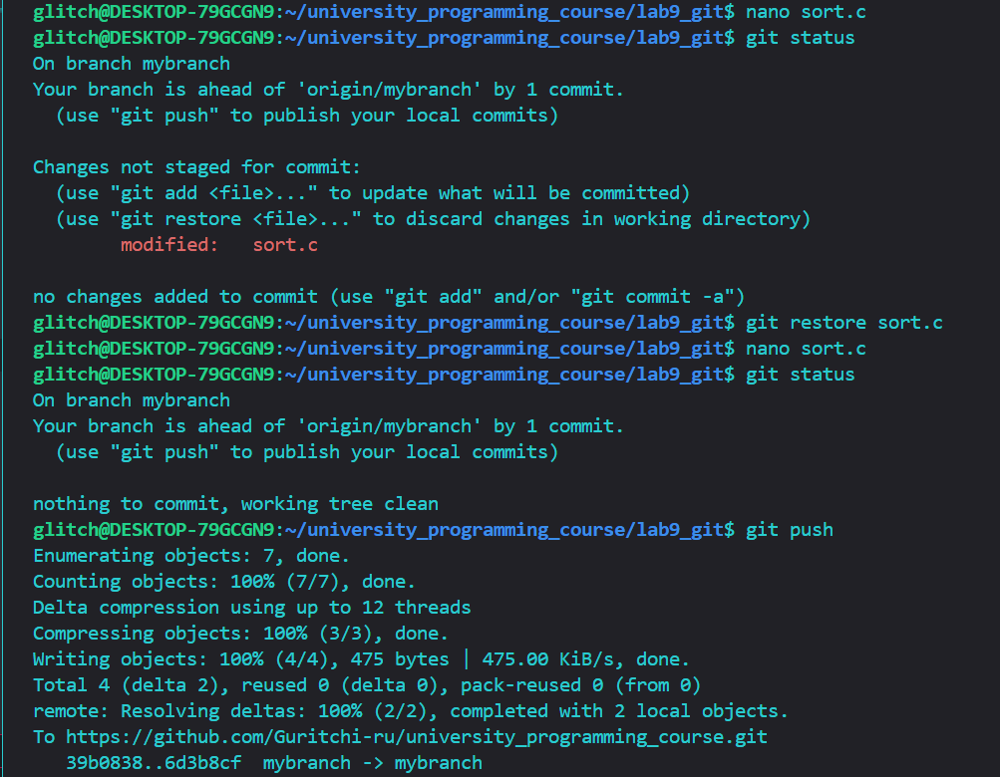
// git status указывает на непроиндексированные изменения

// После git restore в файл sort.c вернулся в состояние до добавления принта. git status указывает на то, что нет изменений в рабочем каталоге

//на 18 шаге
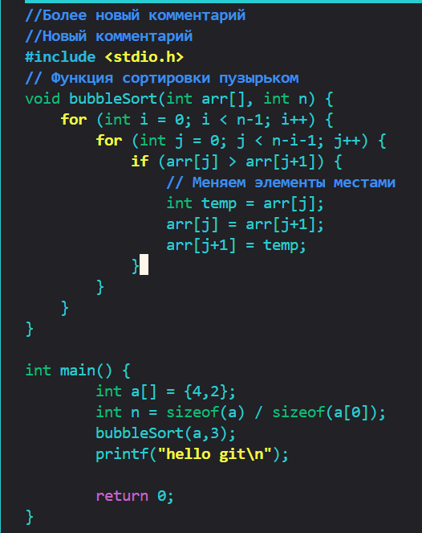
//на 21 шаге
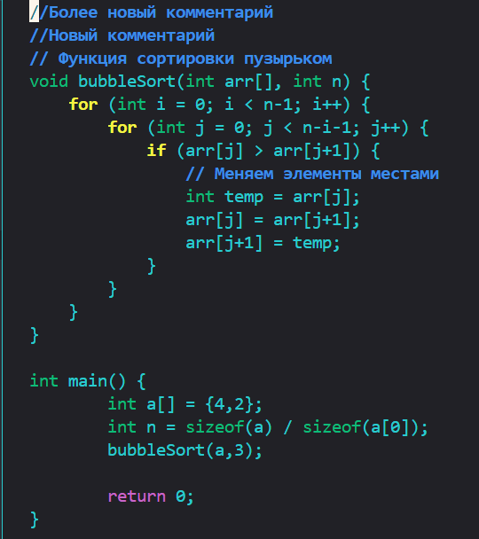

ВЕТКИ и ff-merge

Шаги 1-8
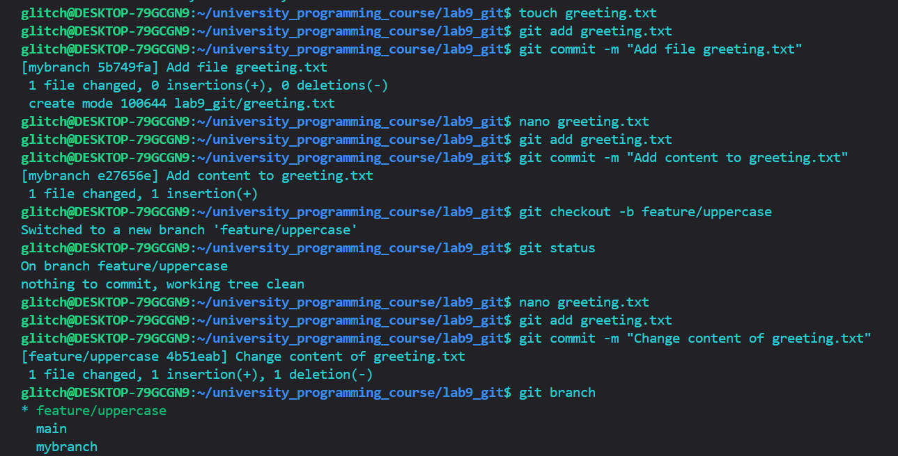
// git status вывел информацию о том, что в новой ветке нет изменений

// git branch указывает на то, что мы находимся на ветке feature/uppercase

Шаги 9-11
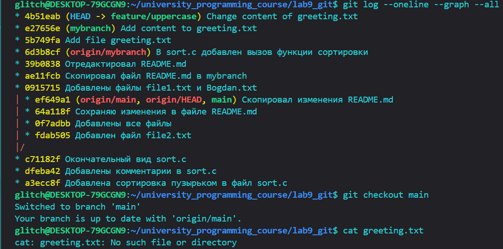
// git log --oneline --graph –all вывел дерево коммитов

// greeting.txt пока что отсутсвует в main, что не позволяет посмотреть его содержимое через cat

Шаги 12-18
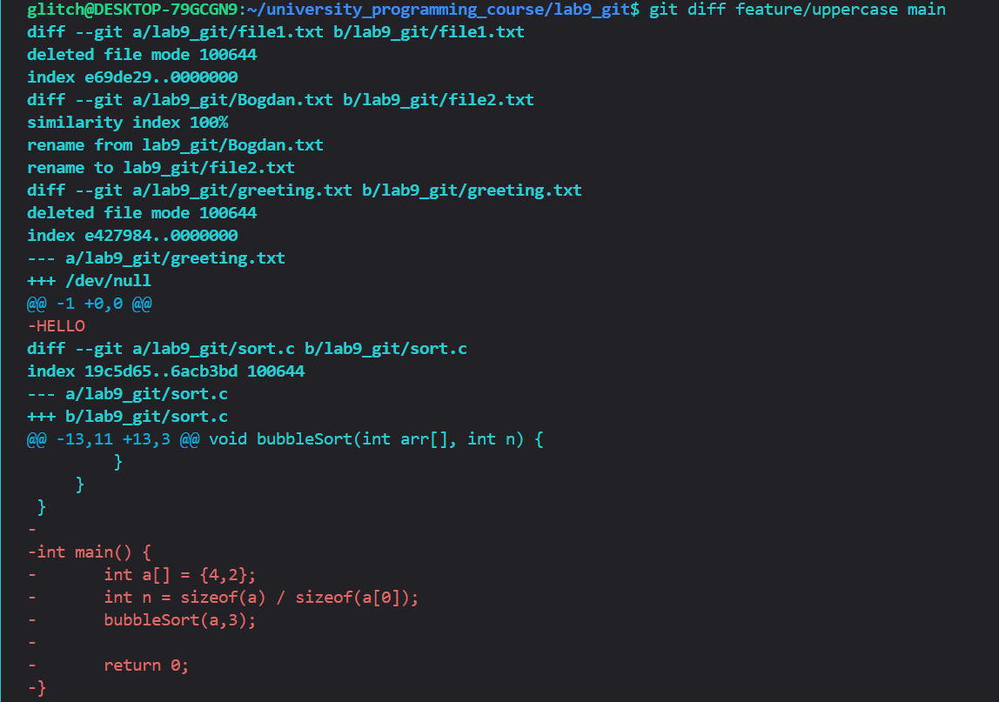
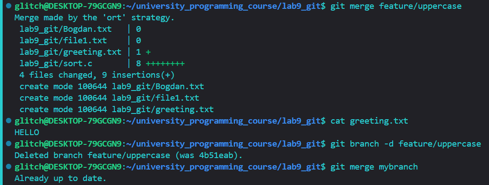
// После слияния веток main и feature/uppercase cat в ветке main выводит HELLO
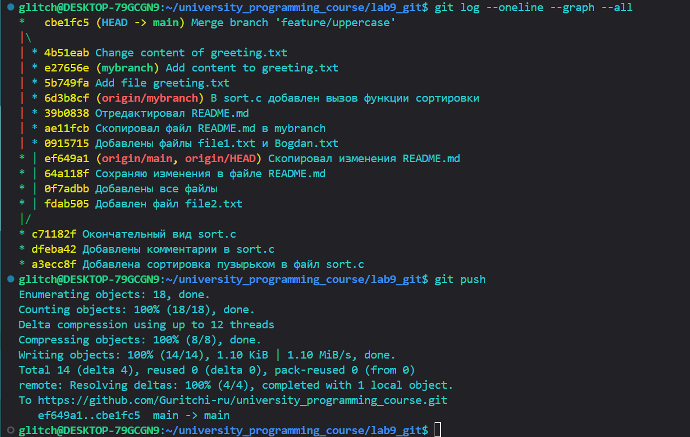
// git log --oneline --graph –all выводит новое дерево коммитов где видно слияние веток